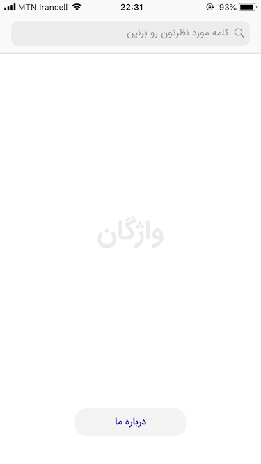
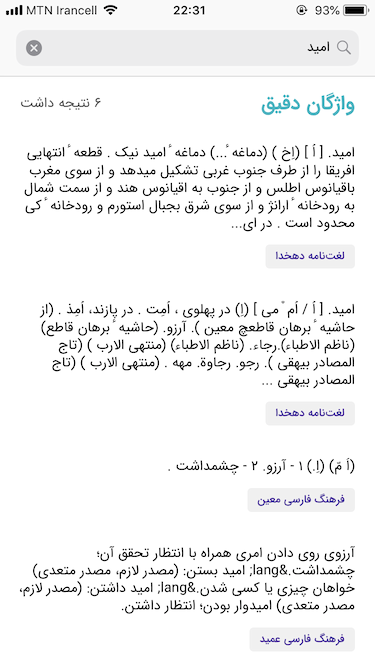
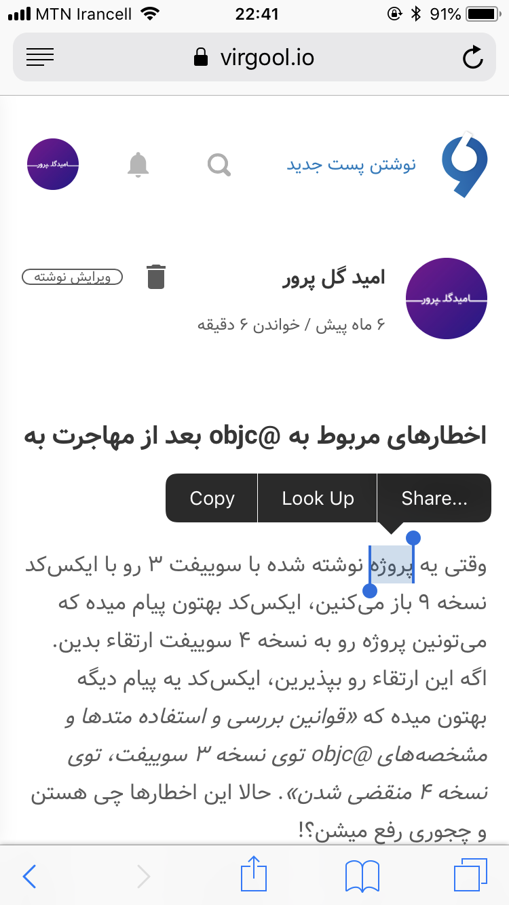
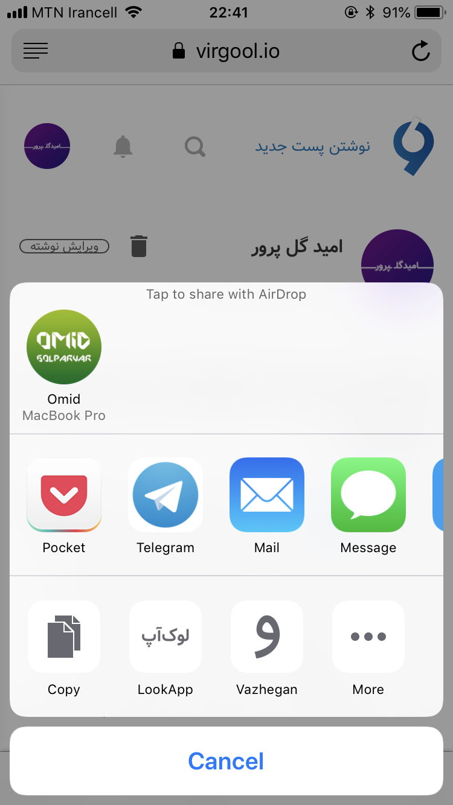
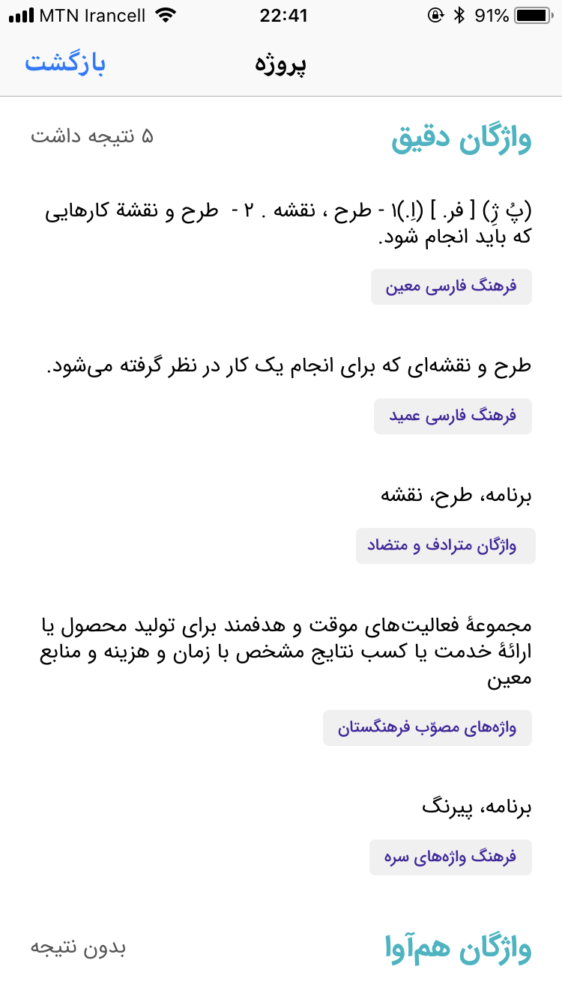

  

<h1 dir='rtl'>واژگان</h1>

یکی از برنامه‌های مربوط به پروژه «اپ‌چی‌ها»

نرم‌افزار واژگان یه لغت‌نامه ساده‌ست که از اطلاعات موجود در پایگاه‌داده وبسایت 
<a href='http://vajehyab.com/'>واژه‌یاب</a>
استفاده می‌کنه.

<h2 dir='rtl'>کارش چیه؟</h2>

کار این نرم‌افزار اینه که کلمه رو تحویل می‌گیره، و توی پایگاه‌داده‌های وبسایت واژه‌یاب، دنبال معنی‌اش می‌گرده. جالبیش به اینه که حتی اگه کلمه به درستی هم نوشته نشده باشده، باز احتمال اینکه معنی‌اش رو پیدا کنین بالاست!! 😎 (البته توی این مورد دم بر و بچه‌های واژه‌یاب گرم 😁)

<h2 dir='rtl'>چجوری باهاش کار کنیم؟</h2>

برای استفاده از این نرم‌افزار، دوتا راه کلی در نظر گرفته شده:

<ul dir='rtl'>
  <li>
    
یکی اینکه نرم‌افزار رو باز می‌کنیم، توی نوار جستجوی بالا کلمه مورد نظرمون رو می‌زنیم و با زدن دکمه تاییدش روی کیبورد گوشی، شروع به جستجو میشه و در نهایت داده‌های دریافتی بهتون نشون داده میشه.
     
     
    
    
    

  </li>
  <li>
    
روش بعدی اینکه فکر کردم دیدم ممکنه بارها توی وب‌گردی‌مون، یه کلمه‌ای بر بخوریم که معنی‌اش رو ندونیم. راهی که پیاده‌سازی شده، بطوریه که دیگه نیاز نیست از اون نرم‌افزار خارج بشیم؛ فقط کافیه کلمه رو انتخاب کنیم، و بعد با استفاده از گزینه «به اشتراک گذاری» کلمه رو بفرستیم برای «واژگان»، تا سریع اپ بیاد بالا و دنبال معنی کلمه مورد نظرمون بگرده.
     
     
    
    
    
     
     
    <h3>⚠️ حواس‌تون باشه!! ⚠️</h3>
    دقت داشته باشین که بصورت پیش‌فرض، اون گزینه مربوط به «واژگان»، توی لیست اکشن‌ها (همون ردیف سوم که کپی و اینا داخلشه)
    قرار نداره. برای اینکه در دسترس قرار بگیره، یبار از طریق گزینه «بیشتر» (همون more خودمون) روشن‌اش کنین.
    

  </li>
</ul>

<h2 dir='rtl'>خب حالا که چی؟!</h2>

هیچی!! یه پروژه کوچولو زدیم، خواستیم بقیه هم ببین و نظر بدن و ازین کارا... 🙄😕

