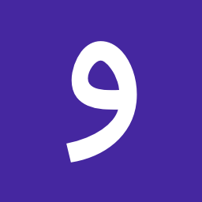

  

<h1 dir='rtl'>واژگان</h1>

یکی از برنامه‌های مربوط به پروژه «اپ‌چی‌ها»

 
 

نرم‌افزار واژگان یه لغت‌نامه ساده‌ست که از اطلاعات موجود در پایگاه‌داده وبسایت 
<a href='http://vajehyab.com/'>واژه‌یاب</a>
استفاده می‌کنه.

